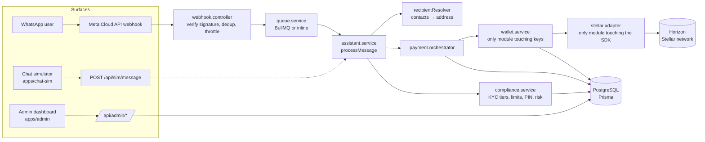

# Architecture

This document describes how SendAm's backend is structured internally, and
the boundary between what ships in this open-source repository and what
runs as a privately-operated service.

## System overview



The simulator path (dotted) is dev-only.

## Wallets: direct custody on Stellar

SendAm generates and holds each user's keys itself — there is no managed
Wallet-as-a-Service provider in the loop. All Stellar-specific logic lives
in one adapter, `apps/api/src/wallet/stellar.adapter.js`:

```js
{
  chain,                                  // 'stellar'
  createWallet(),                         // -> { publicKey, secretKey }
  getBalance(publicKey),                  // -> native-asset balance
  submitPayment({ secretKey, destination, amount, asset }),
  resolveAsset(assetCode),
  validateAddress(address),
  fundTestnetAccount(publicKey),          // testnet-only convenience
}
```

`wallet.service.js` is the only module that talks to the adapter; product
code never imports the Stellar SDK directly. Destinations are Stellar
`G...` StrKey addresses, validated before any payment is prepared.

An earlier iteration ran a second chain (Lisk) behind a chain-registry
abstraction, with rail selection deciding which network settled a payment.
That was removed deliberately: a second chain doubled the custody, audit,
and asset-support surface without adding user value, so the product is now
Stellar-only and the code is flattened to match (the history is preserved
in git if a multi-chain seam is ever needed again).

Private keys are encrypted (AES-256-GCM, `services/crypto.service.js`)
before being stored in the `Wallet` table — plaintext keys never leave
`wallet.service.js`.

An earlier direction also explored managed custody via Thirdweb Engine /
Openfort (Wallet-as-a-Service). That approach is not part of this codebase —
direct custody was chosen instead so wallet behavior (funding, native-asset
transfers) isn't dependent on a third-party provider's API.

## What's in this repo

Everything that makes SendAm's payment flow work is in this repository:
wallet creation, balance checks, payment orchestration, the WhatsApp command
flow, recipient resolution (saved contacts → raw address), compliance/KYC
gating (local tier/limit/risk-scoring logic), and the admin dashboard.
KYC identity verification itself is delegated to a provider (Smile ID /
Dojah) — this repo holds the tier/limit/risk logic, not the identity checks.

## Why this shape

- **Reviewability.** Anyone can read exactly how SendAm talks to Stellar
  and decides what happens to a payment, because that code is the
  whole point of being open source here.
- **Safety.** Wallet private keys stay encrypted at rest and are only ever
  decrypted inside `wallet.service.js` for the duration of a signing
  operation.
- **Extensibility.** The adapter interface (`stellar.adapter.js`) and
  `resolveAsset()` are the seams for the next asset or capability — they
  slot in without touching unrelated code.
